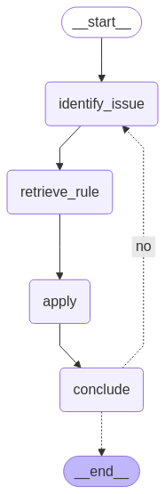

# LexiBlox Agent: An IRAC AI System



## Overview

**IRAC Agent** is an intelligent legal reasoning agent designed to analyze legal scenarios using the IRAC (Issue, Rule, Application, Conclusion) methodology. Built with modern language models and a modular graph-based architecture, the IRAC Agent automates structured legal analysis for research, education, and practical applications.

---

## Architecture

The IRAC Agent is structured as a modular graph, where each node represents a distinct reasoning or processing step in the IRAC methodology:

- **Issue Identification Node:** Extracts and formulates the legal issues from the input clauses.
- **Rule Extraction Node:** Retrieves relevant internal acceptable legal rules, statutes, or precedents from our Rules RAG.
- **Application Node:** Applies the identified rules to the facts, generating logical reasoning.
- **Conclusion Node:** Synthesizes the analysis into a clear, concise conclusion.
- **Output Node:** Formats and returns the complete IRAC analysis.

This architecture enables easy extension, parallelization, and integration with external legal databases or LLMs.

---

## Setup

### Prerequisites

- Python 3.11+
- [Poetry](https://python-poetry.org/) or `pip`
- Access to OpenAI API (OPENAI_API_KEY)

### Installation

Clone the repository and install dependencies:

```
git clone https://github.com/mrlmarquez/case_study.git
cd case_study
pip install -r requirements.txt
```

Or if using poetry

```
poetry install
```

### Environment Variables

Set up your environment variables (e.g., for API keys):

```
export OPENAI_API_KEY=your-api-key-here
```

## Sample Run

You can run the IRAC Agent Demo on a sample legal scenario through the CLI:

```
streamlit run case_study/ui/local_app.py
```


**Sample Output:**


## Citations

This project employs and builds upon research, tools, and resources from the following works and websites. Please refer to them for foundational concepts.

### Research Papers and Methodology

- [IRAC METHOD](https://www.iracmethod.com/irac-methodology) – The framework that this agent is practicing.

- [Can ChatGPT Perform Reasoning Using the IRAC Method in Analyzing
Legal Scenarios Like a Lawyer?
](https://arxiv.org/pdf/2310.14880) – The biggest basis of this project - the researches conducted an empirical assessment of ChatGPT for IRAC analysis in
order to understand how well it aligns with
the analysis of legal professionals.
- [A Benchmark for Lease Contract Review](https://arxiv.org/pdf/2010.10386) – I used a sample of their dataset of 179 lease agreement documents and they have also fined-tuned an LM Model there - ALeaseBert that is trained on that dataset.

### Software and Code Citation
- [Local RAG agent with LLaMA3](https://langchain-ai.github.io/langgraph/tutorials/rag/langgraph_adaptive_rag_local/) – The code base that I used to start the project

- [Streamlit-x-LangGraph-Cookbooks](https://github.com/shiv248/Streamlit-x-LangGraph-Cookbooks) – For a quick UI demo of our agent.
---

If you use this project or its outputs in your research, please ensure you also cite the above resources as appropriate, following your target publication’s citation guidelines.

## Contact

For questions or collaboration, contact [melissarhonamarquez@gmail.com](mailto:your.email@example.com).

---

*Happy reasoning!*
